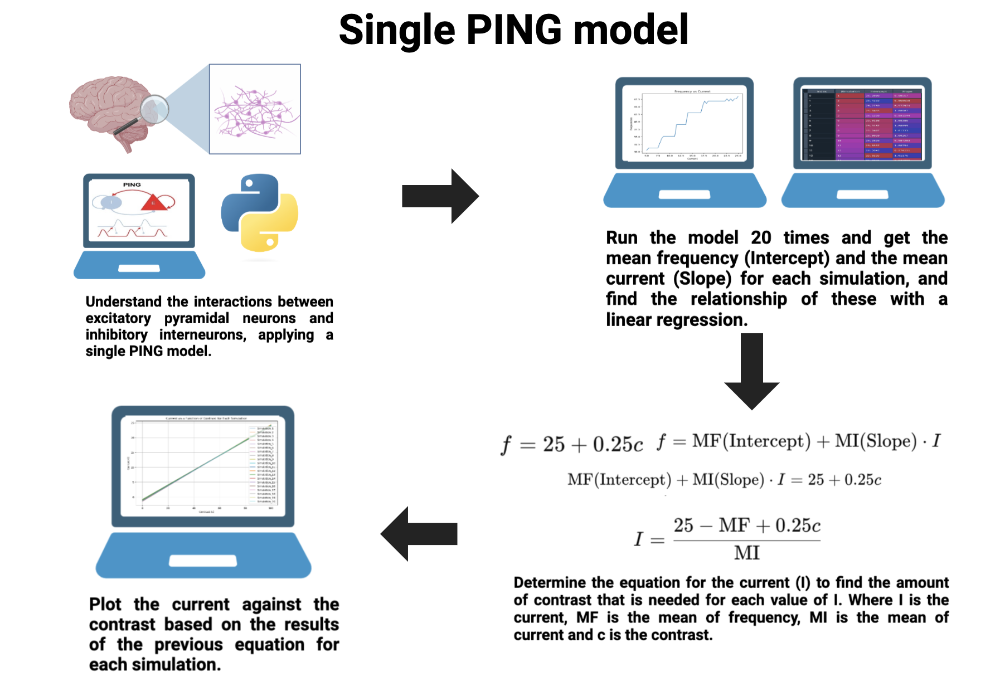
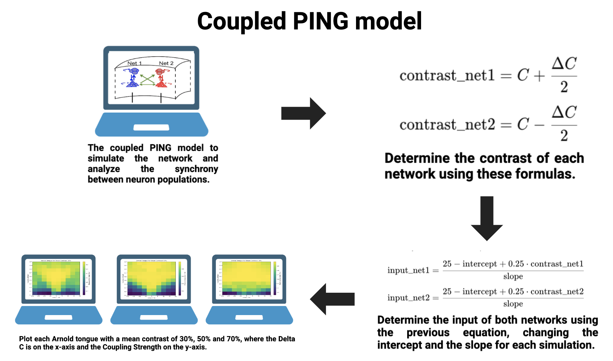

# Oscillation Amplitude and Cortical Synchronization in Neuronal Networks
The next project performs a Pyramidal-Interneuron-Gamma-model (PING) in two different approaches, one as a single simulation (one population) and the other as a coupled simulation (two populations). These codes can be run on any computer with the appropriate Python packages installed in the environment, the code is divided in two main sections, the single PING model and the coupled PING model. 

The Sinlge_PING_Model contains the code to generate the simulation just once, the main code is adapted to call the network_simulation and run the model 20 times. The main goal of this is to find the relationship between the frequency (Intercept)  and the current (Slope).

The Coupled_PING_Model runs simulations between two groups of neurons, in order to study the synchronization between populations. The main code is adapted to call the NeuronNetworkSimulation and perform it just once. The Arnold_Tongue performs the coupled PING simulation called the NeuronNetworkSimulation, the code output is the plot with a mean contrast of 30%, 50% and 70%. 

